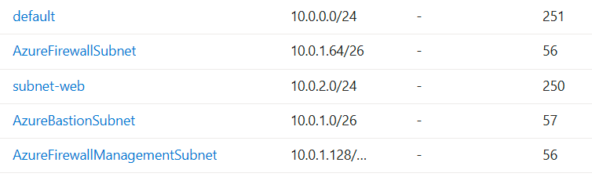
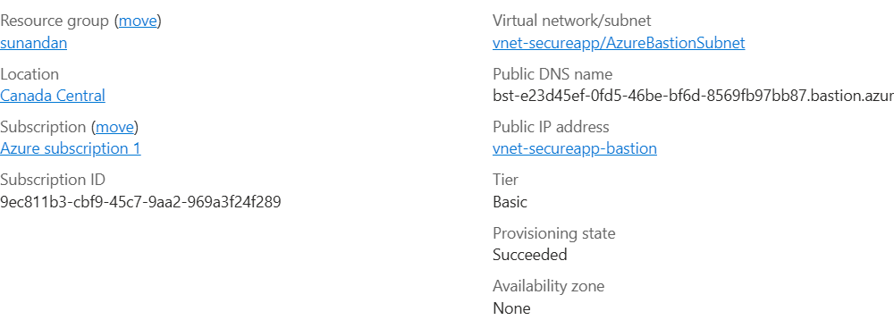
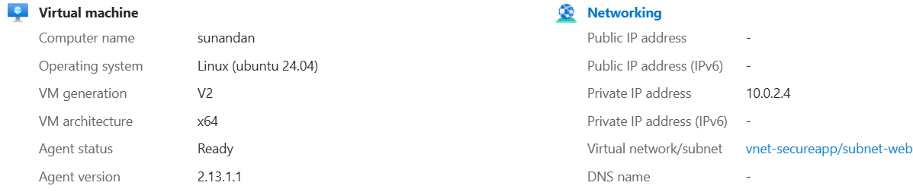
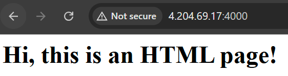
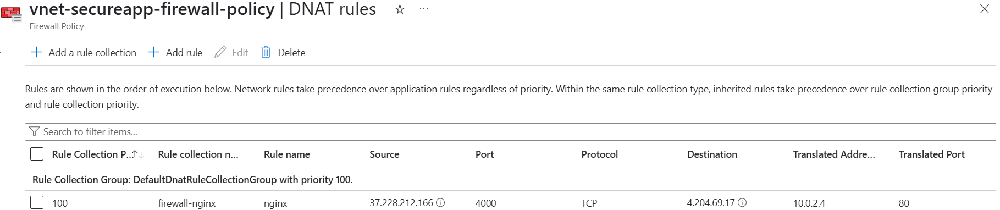
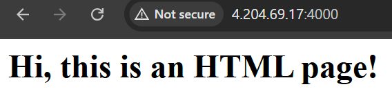

# 🔐 Secure Azure Web App Deployment using Bastion, NGINX, and Azure Firewall

This project demonstrates how to securely deploy a private NGINX-based HTML application on Azure using:

* Azure Virtual Network (VNet) with custom subnets
* A private Ubuntu VM running NGINX
* Secure browser-based SSH via Azure Bastion
* Azure Firewall with DNAT rules to expose only port 80 via Firewall
* Custom Network Security Groups (NSGs)


---

## 🏗️ Architecture Overview

```
Internet (Your IP)
     │
     ▼
Azure Firewall (DNAT on port 4000) ← Only allows your IP
     │
     ▼
subnet-web → Private Ubuntu VM (NGINX, no public IP)
     ▲
Azure Bastion (for secure SSH access)
```



---

## ✅ Key Features

* 🔐 No public IP on the VM
* 🛡️ Azure Firewall DNAT rule allows only **your IP**
* 🔧 NGINX installed and serving a static HTML page
* 🚪 Bastion used for secure VM management (SSH via portal)
* 🔍 Network traffic is fully inspected and controlled



---

## 🧱 Azure Resources Used

* Azure Virtual Network (10.0.0.0/16)

  * `AzureBastionSubnet` (10.0.1.0/26)
  * `AzureFirewallSubnet` (10.0.1.64/26)
  * `AzureFirewallManagementSubnet` (10.0.1.128/26)
  * `subnet-web` (10.0.2.0/24)
* Azure Firewall (Basic Tier + DNAT Rule)
* Azure Bastion
* Ubuntu 20.04 VM (private)
* Custom NSGs

---

## 🚀 Step-by-Step Implementation

### 1. Created VNet `vnet-secureapp` with 4 subnets


### 2. Enabled Azure Bastion in `AzureBastionSubnet`


### 3. Enabled Azure Firewall in `AzureFirewallSubnet` (with public IP)

### 4. Deployed Ubuntu VM in `subnet-web`

* No public IP
* Connected via Bastion



### 5. Installed NGINX and served a static HTML

```bash
sudo apt update && sudo apt install nginx -y
echo '<h1>Hi, this is an HTML page!</h1>' | sudo tee /var/www/html/index.html
sudo systemctl restart nginx
```



### 6. Created DNAT Rule in Azure Firewall Policy

* Source IP: My laptop public IP
* Destination IP: Azure Firewall public IP
* Destination Port: 4000
* Translates to: VM private IP on port 80



### 7. Accessed app at:

```
http://<Firewall_Public_IP>:4000
```

✅ Works only from my IP



---

## 🌟 Learning Outcomes

* Azure VNet & subnet planning
* Bastion configuration for secure management
* Azure Firewall setup with DNAT and custom policy
* NSG rules and least-privilege access design
* Infrastructure architecture thinking

---

## 📁 Screenshots Summary

| Feature            | Screenshot File                  |
| ------------------ | -------------------------------- |
| VNet + Subnets     | `screenshots/vnet-subnets.png`   |
| Bastion Setup      | `screenshots/bastion-config.png` |
| VM Networking      | `screenshots/vm-networking.png`  |
| NGINX Output       | `screenshots/nginx-output.png`   |
| Firewall DNAT Rule | `screenshots/firewall-rule.png`  |
| Browser Access     | `screenshots/browser-access.png` |

---

## 📗 Author

**Sunandan Sekhar Das**
[LinkedIn Profile](https://www.linkedin.com/in/sunandansekhardas/)


---

## 🧠 Inspired By

This project was part of my hands-on Azure learning to showcase DevOps and cloud security best practices.
